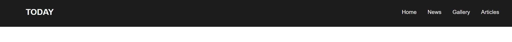
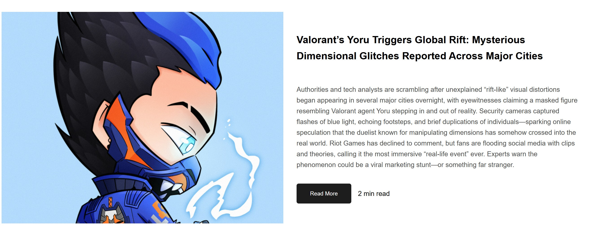
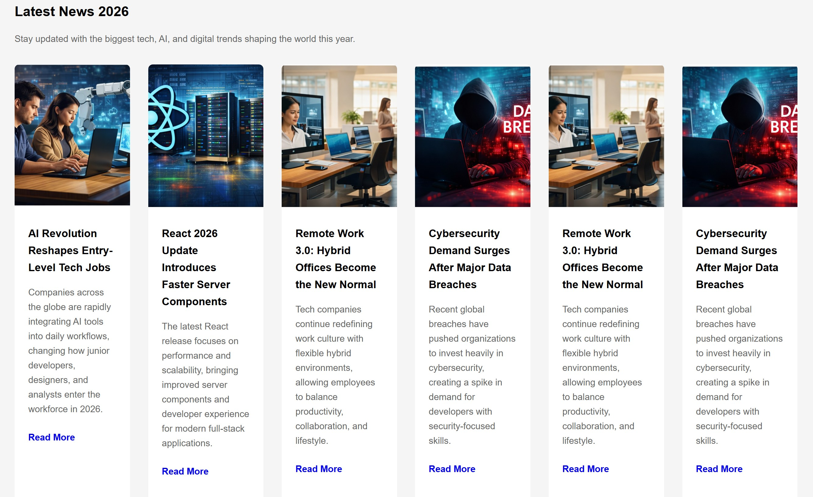
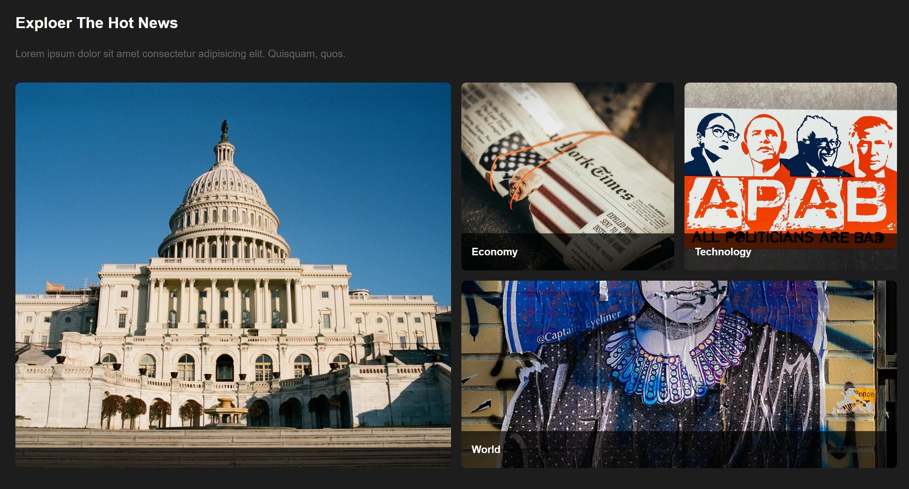
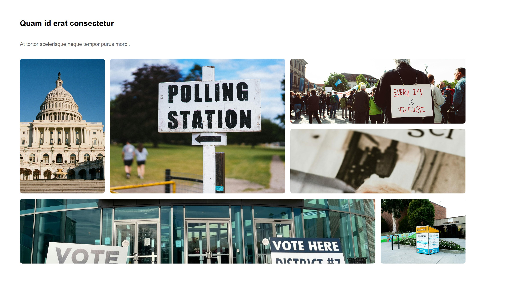

# Today News - Modern News Landing Page

A modern **news-style landing page** built using **HTML5 and CSS3**.
This project focuses on creating a clean and responsive layout using **Flexbox**, **CSS Grid**, and structured UI sections.

---

## Project Overview

**Today News** is a static website that mimics a modern digital news homepage.
The goal of this project is to practice layout design, responsive structure, and modern CSS techniques used in real-world web development.

The website includes several sections commonly found on professional news platforms.

---

## Features

- Clean and modern UI layout
- Responsive header navigation
- Featured news section
- Latest news card grid
- Hot news grid layout
- Masonry-style image section
- News gallery with custom grid areas
- Hover overlay effects
- Mobile responsive layout

---

## Technologies Used

- **HTML5**
- **CSS3**
- **Flexbox**
- **CSS Grid**
- **Responsive Design**

---

## Project Sections

### 1. Header

Navigation bar with logo and menu links.



### 2. Featured News

A large hero-style section displaying the main featured article.


### 3. Latest News

Card-based layout displaying recent news updates.


### 4. Hot News

Grid-based section highlighting trending topics.


### 5. Masonry Layout

Dynamic grid displaying image-based stories.

### 6. News Gallery

Custom CSS grid layout showing a collection of images.


### 7. Footer

Simple footer with copyright information.


---

## Project Structure

```
Today-News/
│
├── index.html
├── style.css
├── images/
│   ├── img1.jpg
│   ├── img2.jpg
│   ├── img3.jpg
│   ├── img4.jpg
│   └── ...
└── README.md
```

---

## How to Run the Project

### Option 1: Open Directly

1. Download or clone the repository
2. Open the project folder
3. Double-click **index.html**

### Option 2: Using VS Code Live Server

1. Open the project in **VS Code**
2. Install **Live Server extension**
3. Right-click `index.html`
4. Click **Open with Live Server**

---

## Learning Objectives

This project was created to practice:

- Semantic HTML structure
- Flexbox layout alignment
- CSS Grid layouts
- Responsive web design
- Image optimization using `object-fit`
- Section-based page design

---

## Future Improvements

Possible improvements for the project:

- Add JavaScript interactions
- Add article detail pages
- Connect to a real News API
- Improve mobile responsiveness
- Add dark/light theme toggle
- Improve accessibility

---

## Author

**Masavi Syed**

---

## License

This project is for **educational and portfolio purposes**.
